# KiCad Workspace / Panelizer / Build Variants / Differ


Kikakuka (企画課, きかくか, Planning Section) (formerly Kikit-UI) is mainly built on top of [KiKit](https://github.com/yaqwsx/KiKit), [Shapely](https://github.com/shapely/shapely), modified [pcb-tools](https://github.com/curtacircuitos/pcb-tools), [OpenCV](https://github.com/opencv/opencv-python), [pypdfium2](https://github.com/pypdfium2-team/pypdfium2) and [PUI](https://github.com/buganini/PUI).

Its FreeCAD integration is inspired by [KiCadStepUp](https://github.com/easyw/kicadStepUpMod) and [KiConnect](https://codeberg.org/kiconnect/KiConnect).

It creates a few more dimensions for KiCad:
* Workspace and project management
* Revision management
* Build variants
* Panelization
* FreeCAD integration for flexible PCB bending and multi-board assembly

> [!CAUTION]
> Due to [KiCad issue #23994](https://gitlab.com/kicad/code/kicad/-/work_items/23994), only one KiCad instance can currently be accessed through the IPC API on Windows.

# Features
* Kikakuka main program
    * Workspace Manager
        * Organize KiCad projects, FabPlans, FreeCAD documents, assemblies, and STEP files in `.kkkk` workspaces with relative paths and file descriptions
        * Open related schematic, PCB, and STEP files or launch Differ and FabPlan from the workspace
        * Inspect project-specific symbol and footprint libraries and convert their paths to `${KIPRJMOD}`-relative references
    * Instance Manager UI
        * Inspect running processes and known file paths in the Instance Manager tab, with one row per FreeCAD document, manual refresh, and Go to actions
    * Differ
        * Highlight changed areas
        * [Schematic diff viewer](#schematics-differ)
        * [PCB diff viewer](#pcb-differ)
        * Git support
    * Fabrication Planner
        * Panelizer
            * Interactive arrangement with real-time preview
            * Freeform placement not limited to M×N grid configurations
            * Support for multiple different PCBs in a single panel
            * [Automatic](#auto-tab) or [manual](#manual-tab) tab creation
            * Automatic V-cut/mousebites selection
            * Enable [hole](#substrate-hole) creation in panel substrate for extruded parts
            * Load [KiKit multiboard files](https://yaqwsx.github.io/KiKit/v1.8/multiboard/) as multiple separate boards
            * No coding skills required
        * Build Variants
            * Single PCB without panelization can be done with frameless setting
            * Each PCB can have its own flag settings
    * Gerber handling
        * Available in the fabrication planner (panelizer)
        * Or direct conversion to .kicad_pcb
        * Compared with KiCad output
            * Better restoration of oval drill holes
            * Allow attaching BOM/CPL (converted to reference-only footprints)
    * CLI
        * Convert saved fabrication plans (`.kkkk_fab`, or legacy `.kikit_pnl`) to KiCad files in one command

* FreekiCAD (FreeCAD Addon)
    * Requires FreeCAD 1.0 or later
    * `FreekiCAD` creates linked FreeCAD objects for external `.kicad_pcb` and STEP files; an `.FCStd` document caches generated geometry while retaining the reloadable source paths
    * Import and export lightweight `.kkkk_asm` assembly manifests as JSON; manifests contain no cached geometry, prefer source paths relative to the manifest, and freshly load every external source when imported
    * Linked objects work with the `Assembly` and `Manipulator` workbenches, as well as FreeCAD's built-in transform tool; FreeCAD Assembly can place `PcbObject` Links but currently cannot resolve their child component or connector faces for joints, so use the Manipulator workbench to align those faces; exporting selected `App::Link` instances or an Assembly to `.kkkk_asm` flattens their final global placements
    * A sketch is provided for real-time board outline editing in FreeCAD
    * Components moved in FreeCAD are synced to KiCad in real time
    * `AutoReload` is enabled by default for both linked PCB and STEP objects; source-file changes are reloaded automatically, with manual reload also available
    * Optional copper and solder-mask import, with outer copper, inner copper, and mask controlled independently
    * Solid [stiffeners](##flexible-pcb-stiffener) from annotated `F.Stiffener` and `B.Stiffener` user-layer areas
    * [Flex PCB bending](#flexible-pcb-bending) driven by bend lines and parameters defined in KiCad
    * [Automatic coupler-based PCB alignment](#coupler-based-pcb-alignment) using matching `CouplerFixed` and `CouplerMoving` footprints or an absolute `CouplerAt`, with coupler plane markers for inspection
    * `kicad-python` is used and an on-demand instance mesh handles multiple KiCad instances & API sockets, even without Kikakuka's main program.

* KiCad Plugin/Library
    * Coupler footprints for [Automatic coupler-based PCB alignment](#coupler-based-pcb-alignment)
    * Plugin actions for previewing and hiding coupler helpers in the 3D Viewer
    * Populate scaled placeholder 3D models for footprints without a valid model, using `SizeX`, `SizeY`, and `SizeZ` properties

* Instance Manager
    * An Instance Manager mesh node runs in every Kikakuka and FreekiCAD host process
    * Discover KiCad and FreeCAD instances on demand and coordinate file-opening requests across Kikakuka and FreekiCAD, even without the Workspace Manager
    * Navigate KiCad files by reusing open PCB editors or recalling editor windows (macOS and Windows); launch multiple KiCad instances automatically on macOS
    * Seamlessly navigate FreeCAD files by activating an open document or opening it in an existing instance


# Workspace Manager
The `.kkkk` file saves workspace information in JSON format.
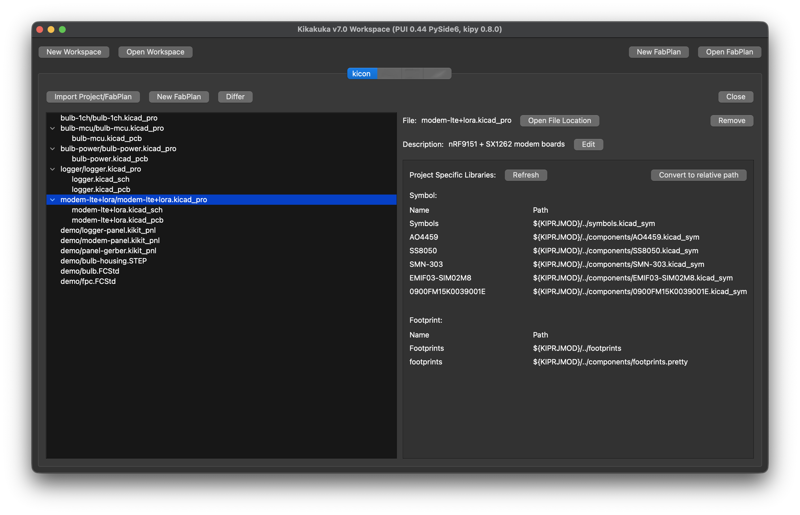

# Differ
## Schematics Differ
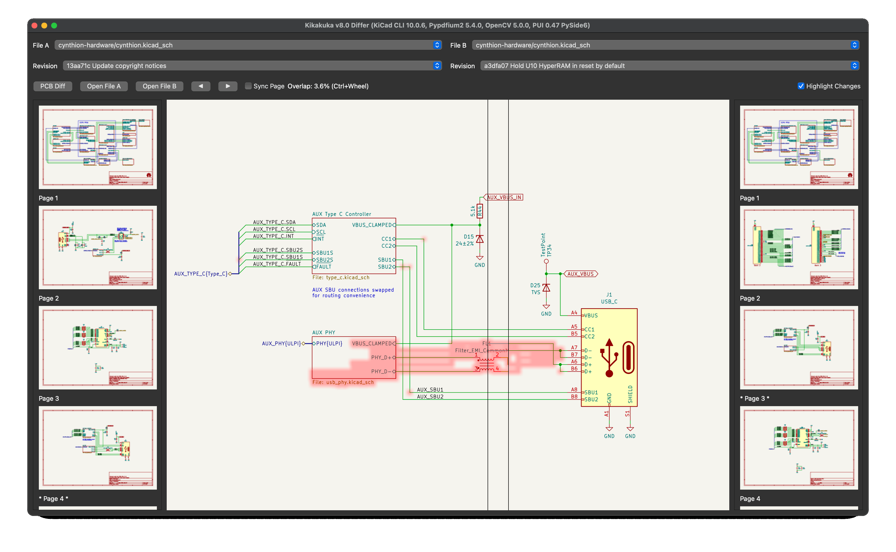

## PCB Differ
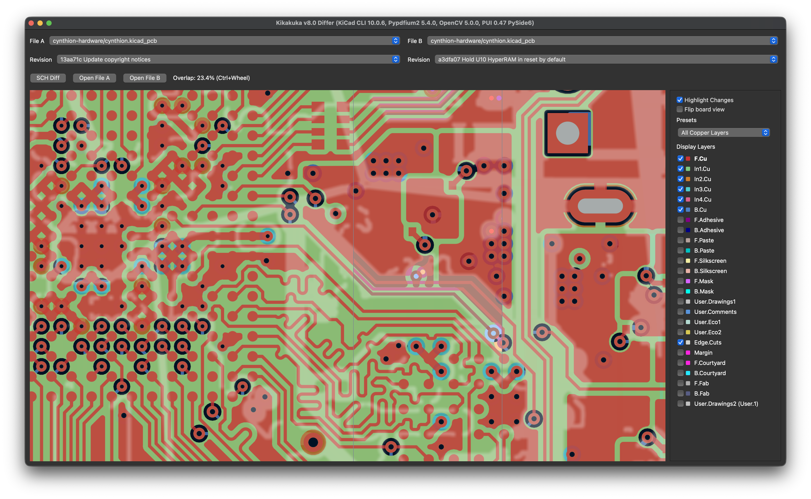
* A diff sample of [cynthion-hardware](https://github.com/greatscottgadgets/cynthion-hardware)

# Fabrication Planner
The `.kkkk_fab` file saves panelization and build-variants settings in JSON format, with PCB paths stored relative to the file's location. Legacy `.kikit_pnl` files can still be opened or added; newly saved fabrication plans use `.kkkk_fab`.

# Fabrication Planner - Build Variants
Example: [`samples/build_variant.kkkk_fab`](samples/build_variant.kkkk_fab) and [`samples/build_variant.kicad_pcb`](samples/build_variant.kicad_pcb).

Set `BUILDEXPR` in footprints' properties. This can be done quickly with `Symbol Fields Table` using the current sheet only scope. Remember to sync them to PCB afterward.

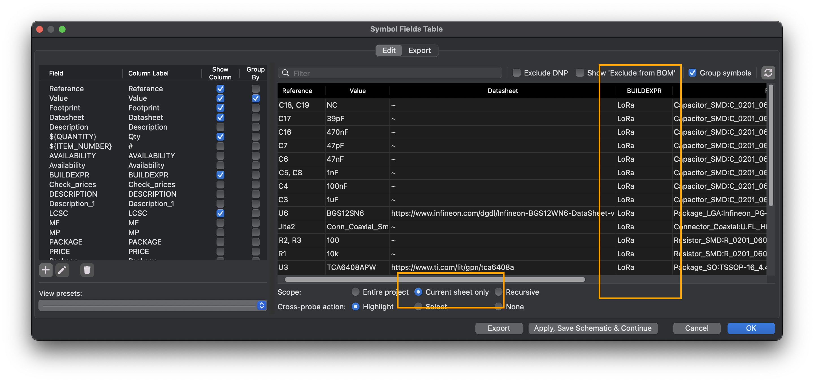

* Kikakuka extracts build flags from `BUILDEXPR`. Selected flags are interpreted as true, and vice versa.
* Footprints with the BUILDEXPR evaluated as false will be marked as DNP.
* Footprints with unset or empty BUILDEXPR will be kept as is.

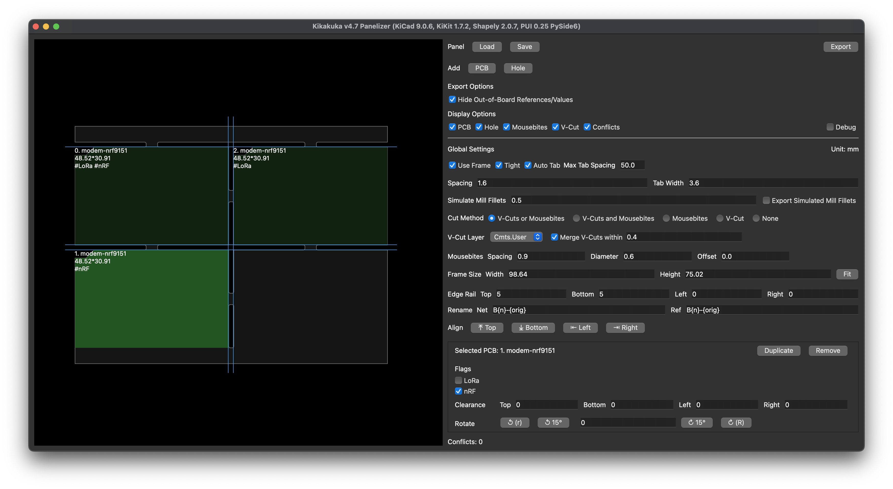

## BUILDEXPR
A boolean expression with operators:
* `~` Not
* `&` And
* `|` Or

It can be as simple as a build name as shown in the image above or an expression like `(A | ~B) & C`.

Panelization with different build variants
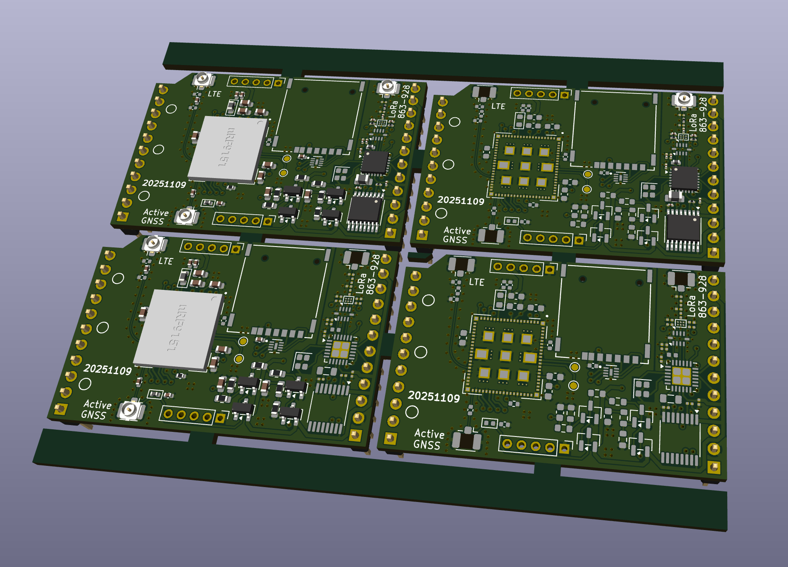

Single PCB without panelization can be done with frameless setting
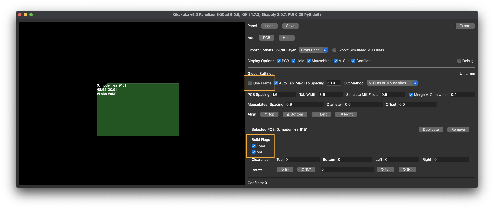

## Field Values Variants
`Field#Flag` or multiple flags like `Field#FlagA#FlagB` will set `Field` to the value where build flags contain all the flags.
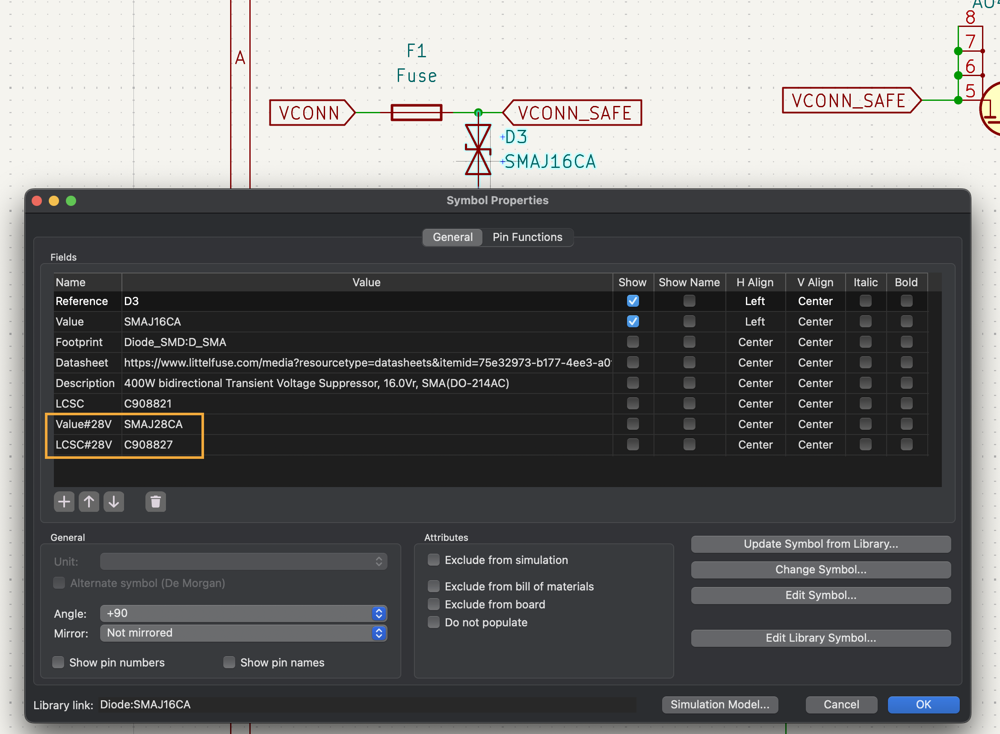
`Field#Opt=A`, `Field#Opt=B` will be displayed as dropdown options.

# Fabrication Planner - Panelizer

## Global Alignment


## Per-PCB Alignment


## Substrate Hole


## Tight Frame + Auto Tab + V-Cuts *or* Mousebites

### Output

### 3D Output


## Tight Frame + Auto Tab + V-Cuts *and* Mousebites


## Loose Frame + Auto Tab + Mousebites

### 3D Output


## Auto Tab
Tab position candidates are determined by the PCB edge and max_tab_spacing, prioritized by divided edge length (smaller first), and skipped if there is a nearby candidate (distance < max_tab_spacing/3) with higher priority.

In the image below with debug mode on, small red dots are tab position candidates, larger red circles are selected candidates, and the two rectangles represent the two half-bridge tabs.


## Manual Tab
Auto tab is off for PCB with manual tabs.
Drag inside the PCB for moving selected tab, drag outside the PCB for changing the direction for the selected tab.
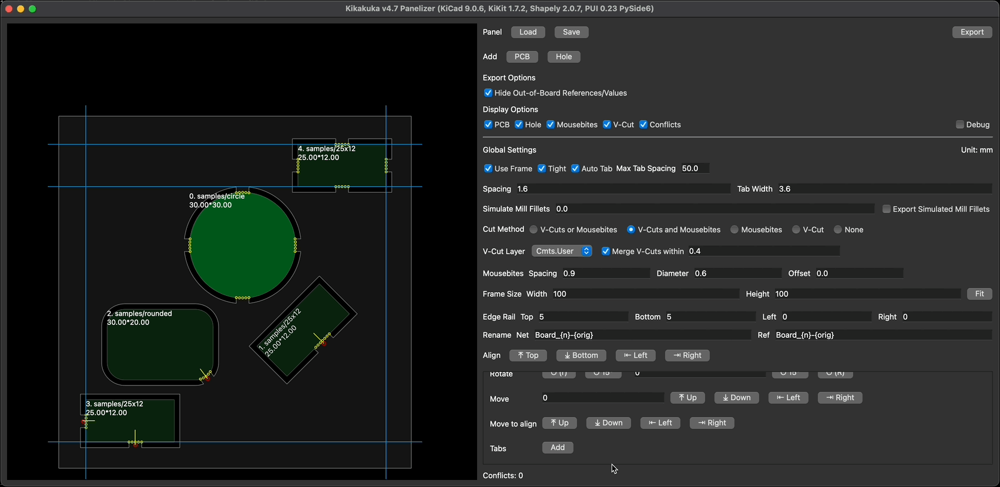

# FreekiCAD (FreeCAD Addon)
Requires **FreeCAD 1.0** or later and `psutil>=5.9` for
instance discovery and FreeCAD document-state publication. KiCad PCB
integration additionally requires **KiCad 9.0** or later,
`kicad-python>=0.8,<0.9`, and `shapely>=2.0.7`. The latter two packages are
optional for STEP-only workflows. FreeCAD Addon Manager may not automatically
install `psutil` where its allowed-package list excludes it;
install it manually inside FreeCAD if necessary.

FreekiCAD and Kikakuka discover each other on demand through local Unix sockets
or Windows named pipes. FreeCAD can manage KiCad
instances without the Workspace Manager running. No board, assembly, or usage
data is sent to third parties.

When opening a FreeCAD file, Kikakuka first looks for an already open document
or reuses a responding FreeCAD instance; see
[Instance Manager](doc/INSTANCE_MANAGER.md) for details.

KiCad `.kicad_pcb` boards and STEP models remain external files referenced by
path. When saved as `.FCStd`, the FreeCAD document caches their generated
objects and geometry, but the links remain reloadable from the source files. A
`.kkkk_asm` manifest stores only source paths, settings, and placements; it
never contains cached objects or geometry. Source paths are stored relative to
the manifest whenever possible and resolved from its directory on import, when
every external source is loaded fresh. `AutoReload` is enabled by default on
both object types, so changing either source file reloads its linked FreeCAD
object. The option can be disabled independently for each object.

* Manually install FreekiCAD
    * Open FreeCAD's python console: Menubar -> View -> Panels -> Python Console
    * Get the installation path by executing `print(os.path.join(App.getUserAppDataDir(), "Mod"))` in the Python console
    * Create the `Mod` folder if it does not exist
    * Copy the FreekiCAD folder into the `Mod` folder
    * Install `psutil` inside FreeCAD. For full KiCad integration, the following command also installs the KiCad extras. It waits for pip to finish, then prints its output.
    ```
    import subprocess,os,sys; print(subprocess.run([os.path.join(os.path.dirname(sys.executable),"python"),"-m","pip","install","kicad-python>=0.8,<0.9","shapely>=2.0.7","psutil>=5.9"],stdout=subprocess.PIPE,stderr=subprocess.STDOUT,text=True).stdout)
    ```

* Activate `Preferences -> Plugins -> Enable KiCad API`. Kikakuka or FreekiCAD can reuse a running matching KiCad editor or start one on demand.
* FreekiCAD (FreeCAD Addon)
    * Add PCB
        * Drag and drop / Open / Import
            * Drag a `.kicad_pcb` file into FreeCAD, or use FreeCAD's Open or Import command; switching workbenches is not required.
        * FreekiCAD menu
            * Switch to the `FreekiCAD` workbench.
            * Menubar -> FreekiCAD -> Add KiCad PCB.
        * All of these entry points create the same linked PCB object.
        * The selected `.kicad_pcb` remains an external file and is represented by a linked `PcbObject`. Its `AutoReload` property defaults to enabled.
    * Add STEP
        * Menubar -> FreekiCAD -> Add STEP
        * The selected STEP model remains an external file. Its `AutoReload` property defaults to enabled, and its Placement is preserved when the source file is manually or automatically reloaded.
    * Reload PCB
        * Right-click on the board object -> Reload KiCad PCB
    * Export or import an assembly manifest
        * Use FreeCAD's standard Export command to write `.kkkk_asm`, or its Import command to read `.kkkk_asm`; select `FreekiCAD Assembly (*.kkkk_asm)` as the file type.
        * The JSON stores only each external PCB or STEP source path, editable FreekiCAD settings, and its placement. It contains no cached objects or generated geometry, and every external source is loaded fresh during import. Export prefers paths relative to the manifest and falls back to absolute paths only when necessary; relative paths are resolved from the manifest's directory. FreeCAD regenerates object names and labels during import.
        * Selecting an original `PcbObject` or `StepObject` exports its own Placement. Selecting one or more `App::Link` instances exports each linked source at that instance's final global placement. Selecting an `Assembly::AssemblyObject` recursively expands its direct and nested Links, including multiple instances of the same source.
        * Assembly and Link exports are flattened placement snapshots; `.kkkk_asm` does not store Links, joints, constraints, remaining degrees of freedom, or the Assembly hierarchy. A linked PCB snapshot is exported with `SnapToCoupler` disabled in the manifest so coupler alignment cannot overwrite its solved Assembly placement; the source `PcbObject` in the current FreeCAD document is not modified.
        * When original PCB source objects are selected directly, Placement is omitted for a `CouplerMoving` board if the same export contains its matching `CouplerFixed` board; coupler alignment recalculates that placement after import.
        * Headless STEP export: `freecadcmd scripts/kkkk_export.py input.kkkk_asm output.step`; the input may also be a single `.kicad_pcb`. See [Headless STEP Export](FreekiCAD/README.md#headless-step-export) for platform-specific paths and requirements.
    * Edit Board Shape
        * Expand the object's children.
        * Open the sketch with the `_Outline` suffix.
    * Inspect Copper Layers
        * FreekiCAD imports tracks, filled zones, pads, vias, and copper-layer graphics as separate `F.Cu`, `In*.Cu`, and `B.Cu` child objects.
        * `ImportOuterCopper` independently controls `F.Cu` and `B.Cu`; `ImportInnerCopper` controls `In*.Cu`. Both default to off.
        * Inner layers use their physical stackup Z and are normally hidden by the board body; hide the board or make it transparent to inspect them.
        * Copper is rendered as one unioned zero-thickness face per layer, eliminating overlap between tracks, pads, vias, and zones. Each face retains its physical stackup Z, so inner layers follow the correct bend radius.
        * The substrate remains one body. Imported outer copper reserves its physical stackup thickness at the body boundary; inner copper does not create expensive internal body cavities. Finished board thickness and component/coupler Z never change.
    * Inspect Solder Mask
        * `ImportSolderMask` imports translucent `F.Mask` and `B.Mask` child objects, with pad/via openings computed by KiCad plus explicit mask-layer graphics. It defaults to off.
        * The resulting F/B mask-opening geometry is also subtracted from stiffener solids on the matching side.
        * With mask import enabled, the board body uses the configured dielectric stackup colors and KiCad opacity, or white with KiCad's default board-body opacity when no color is available. Mask opacity likewise follows its KiCad stackup color. Both display opacities are scaled to 70% in FreeCAD. With mask import disabled, the original opaque board color is preserved.
        * Mask is a zero-thickness face at the finished outer surface. Imported mask reserves its physical outer stackup thickness in the single substrate body; when mask import is disabled, the body fills that thickness.
    * Inspect Silkscreen
        * `ImportSilkscreen` imports board- and footprint-level graphics, references, values, fields, and free text from `F.SilkS` and `B.SilkS`. It defaults to off.
        * Silkscreen is extruded outward from the finished board boundary and renders its outward surface and walls without an inward interface surface. It is additive and does not consume finished board thickness.
    * [Flexible PCB Stiffener](#flexible-pcb-stiffener)
        * Import annotated stiffener solids automatically from `F.Stiffener` and `B.Stiffener` user layers.
    * [Coupler-Based PCB Alignment](#coupler-based-pcb-alignment)
        * Place a `CouplerFixed` footprint on the reference PCB and a `CouplerMoving` footprint on the PCB to be aligned. Couplers are matched by their KiCad reference.
        * Alternatively, place one `CouplerAt` on a PCB to align it with a virtual `CouplerFixed` at the absolute FreeCAD world coordinates given by its `TargetX`, `TargetY`, and `TargetZ` properties. All three default to `0 mm`. Usually place `CouplerAt` on B.Cu so the PCB bottom surface is positioned at `TargetZ`; use F.Cu only when the top surface should be the reference. A PCB may contain only one positioning source: one `CouplerMoving` or one `CouplerAt`.
        * After any linked PCB reloads, positioning is recalculated for every linked PCB in dependency order. A concurrently reloading PCB is skipped until its fresh poses and bent markers are available; its completion triggers another full pass. A PCB with `SnapToCoupler` enabled (the default) is moved as a whole so that its moving coupler plane meets the matching fixed coupler plane face-to-face; disabling it excludes that PCB from automatic positioning. Alignment uses each plane's position after flex-PCB bending. Each coupler is also available as a child object in FreeCAD; its plane marker is hidden by default and can be shown for inspection.
        * FreekiCAD checks the saved coupler list against KiCad's live document every second, including unsaved position, side, rotation, `Z`, `Offset`, `Tilt`, and `CouplerAt` target edits. A changed pose updates its marker and recalculates linked-board positioning. The coupler child object's footprint position and local-plane properties are editable in FreeCAD; edits update the marker and linked-board positioning immediately and are written back to the live KiCad footprint. `Y` is shown using FreeCAD's axis convention. Older footprints without an `Offset` field load as `0 mm`; editing `Offset` in FreeCAD creates the missing hidden KiCad field automatically. Adding, removing, or changing the identity of couplers takes effect on the next PCB reload, which rebuilds the saved list.
        * The [`kicad-addon/library`](kicad-addon/library) directory provides [`CouplerFixed`](kicad-addon/library/footprints/Kikakuka.pretty/CouplerFixed.kicad_mod), [`CouplerMoving`](kicad-addon/library/footprints/Kikakuka.pretty/CouplerMoving.kicad_mod), and [`CouplerAt`](kicad-addon/library/footprints/Kikakuka.pretty/CouplerAt.kicad_mod).
        * Alignment example boards: [`assembly-power.kicad_pcb`](samples/assembly-power.kicad_pcb), [`assembly-mcu.kicad_pcb`](samples/assembly-mcu.kicad_pcb), [`assembly-led.kicad_pcb`](samples/assembly-led.kicad_pcb), and [`assembly-mezzanine.kicad_pcb`](samples/assembly-mezzanine.kicad_pcb).
        * The coupler plane is defined by the footprint position, side, rotation, and these custom footprint properties:
            * `CouplerFixed` and `CouplerMoving` use `Z` to move the plane origin along the PCB surface normal. It defaults to `0 mm`; the origin starts at the PCB surface, including the board thickness on F.Cu, and the direction is reversed on B.Cu.
            * `Offset` moves the plane origin on the PCB surface in the direction indicated by the footprint triangle. It defaults to `0 mm`. `Z` and `Offset` accept values without a unit as millimetres and support `mm`, `in`, `mil` (`0.001 in`), and `um`.
            * `Tilt` tilts the plane around the footprint's local X axis. It is specified in degrees and defaults to `0`.
            * `CouplerAt` uses `TargetX`, `TargetY`, and `TargetZ` as its absolute FreeCAD world target and does not have a local `Z` property. The target properties default to `0 mm`; the same length units are supported. B.Cu is recommended for the usual bottom-surface placement at `TargetZ`; use F.Cu only to reference the top surface.
        * Placement applies the footprint position and rotation, then `Offset`, `Z`, and `Tilt`. `Tilt` rotates around the footprint's local X axis at the offset origin; it does not redirect either displacement. The footprint's normal KiCad rotation supplies the rotation around its local Z axis.
    * [Flex PCB Bending](#flexible-pcb-bending)
        * Name a KiCad graphical layer `FreekiCAD` (case-insensitive) and draw bend lines on it as line segments.
        * Panel export maps every source PCB's `FreekiCAD` drawings to one collision-free User layer and preserves the `freekicad` layer name, even when source boards use different `User.x` layers.
        * Add bend parameters as text on the same `FreekiCAD` layer near a bend line endpoint, for example `a=-70 r=0.5` or `a=-70 s=0.61`.
            * The text anchor must be within `0.1 mm` of a bend line endpoint.
            * `a` is bend angle in degrees.
            * `r` is bend radius in mm.
            * `s` is bend spanning in mm and is used to derive `r` when `r` is omitted, using the board thickness from stackup.
        * After loading the board in FreeCAD, each bend line appears as a child object with `Angle`, `Radius`, and `Active` properties.
        * The linked PCB object also has an `EnableBending` property to toggle the deformation on or off.
        * Imported copper and solder mask are cut with the same board pieces. Rigid display faces follow each piece, while faces in a bend band are rebuilt with the wedge's curved point mapping.
        * If no bend text is provided, the bend line still loads and can be configured directly in FreeCAD.

## Coupler-Based PCB Alignment

https://github.com/user-attachments/assets/c20a8d80-be67-4816-9a69-82f348ab255e

### Positioning Arguments
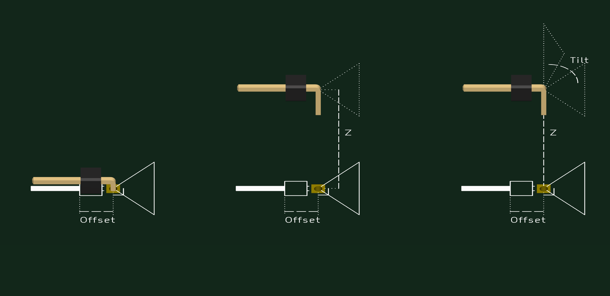

### Coupler Pair

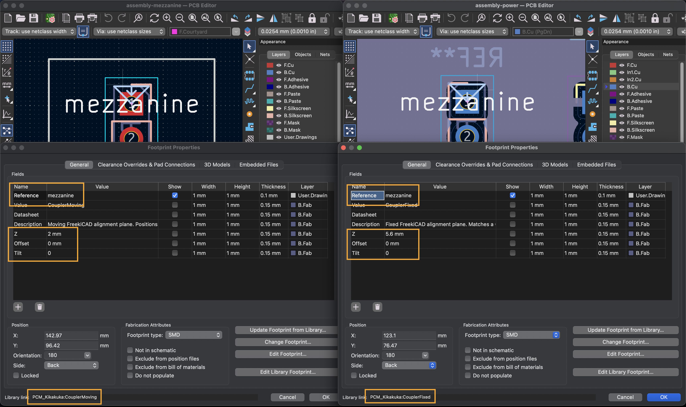
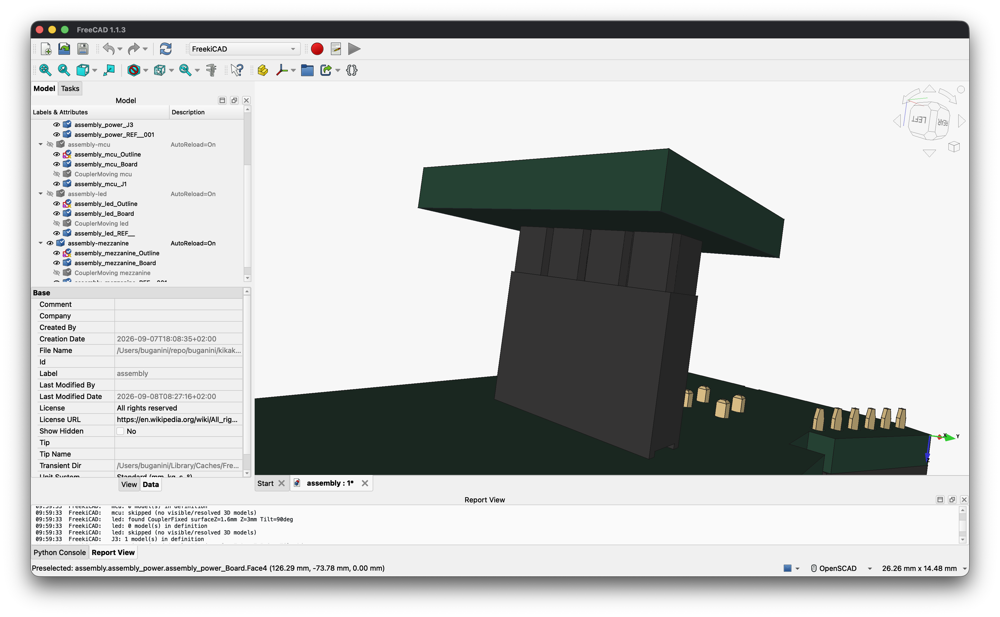

### Changing Z and Tilt

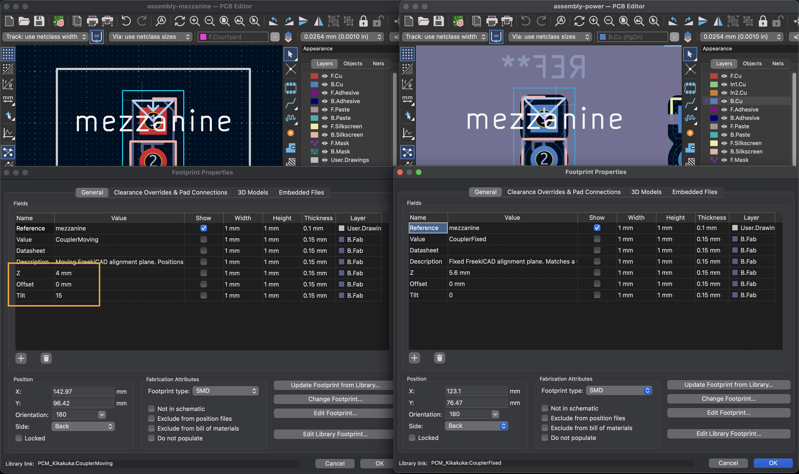
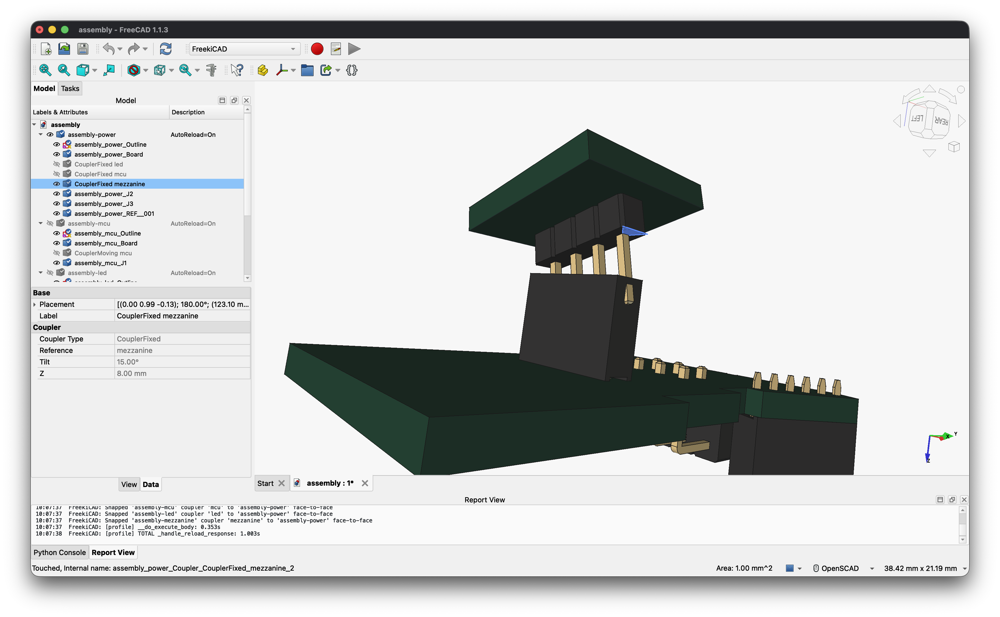

Coupler plane markers are available as child objects in FreeCAD and are hidden by default.

## Flexible PCB Stiffener
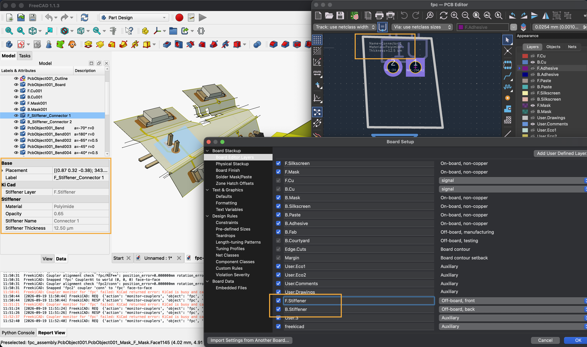

Rename KiCad user layers to `F.Stiffener` and/or `B.Stiffener`
(case-insensitive). Each closed rectangle, circle, polygon, or connected
line/arc outline is imported automatically as one stiffener area; the KiCad
display fill may be on or off.
Put one text annotation inside each area and separate properties with `/` or
newlines:

```text
Name=Tail reinforcement
Material=Polyimide
Color=#C87518
Opacity=0.65
Thickness=25 um
```

`Material` and `Thickness` are required. `Name`, `Color`, and `Opacity` are
optional and property names are case-insensitive. A non-empty `Name` becomes
the suffix of the FreeCAD child name and label (`F_Stiffener_<Name>` or
`B_Stiffener_<Name>`) and is included in bend-overlap warnings. Thickness
accepts `mm`, `in`, `mil` (`0.001 in`), and `um`; a unitless value is
interpreted as millimetres.

Invalid annotations, annotations outside an area, and areas with multiple
annotations are reported as errors and skipped. Unannotated areas are skipped
with a warning.

| Material | Default color | Default opacity |
| --- | --- | ---: |
| `FR4` | `#C8B45A` | `0.90` |
| `Polyimide` | `#C87518` | `0.65` |
| `Stainless_Steel` | `#A7ADB4` | `1.00` |
| `3M468` | `#F2E3BD` | `0.28` |
| `tesa8854` | `#EEE8D8` | `0.45` |
| `3M9077` | `#DDE8EE` | `0.30` |

Other material names are accepted with a warning. When `Color` or `Opacity`
is omitted for an unlisted material, the corresponding `Polyimide` default is
used.

Front stiffeners extend outward from the front silkscreen plane; back
stiffeners extend outward from the back silkscreen plane. They remain rigid
during flex bending. Pad, via, and explicit mask-graphic openings on `F.Mask`
are cut through front stiffeners; `B.Mask` openings are cut through back
stiffeners. This happens even when `ImportSolderMask` is disabled. If a
stiffener overlaps the full bend band, FreekiCAD prints a warning containing
the stiffener name, bend name, and overlap area.

Stiffener thickness is additive outside the finished PCB and is never counted
in or subtracted from the board body.

## Flexible PCB Bending
Manual bending checks are currently done with these sample boards:

* [`samples/fpc.kicad_pcb`](samples/fpc.kicad_pcb)
* [`samples/maze.kicad_pcb`](samples/maze.kicad_pcb)
* [`samples/maze_radius.kicad_pcb`](samples/maze_radius.kicad_pcb)

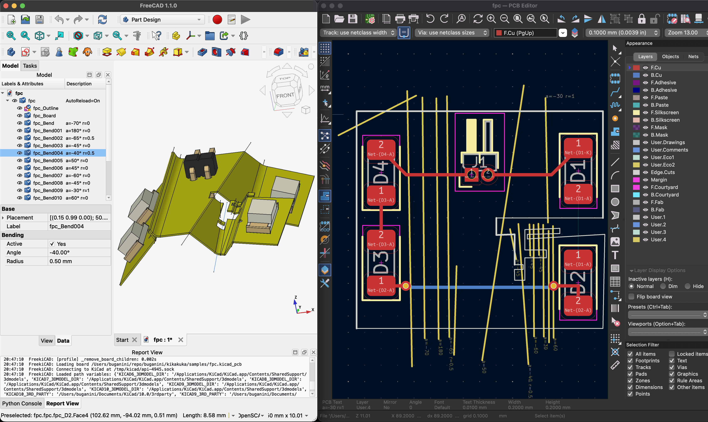

For the implementation details of the bending pipeline, see [`FreekiCAD/ARCHITECTURE.md`](FreekiCAD/ARCHITECTURE.md).

### Bending + Assembly
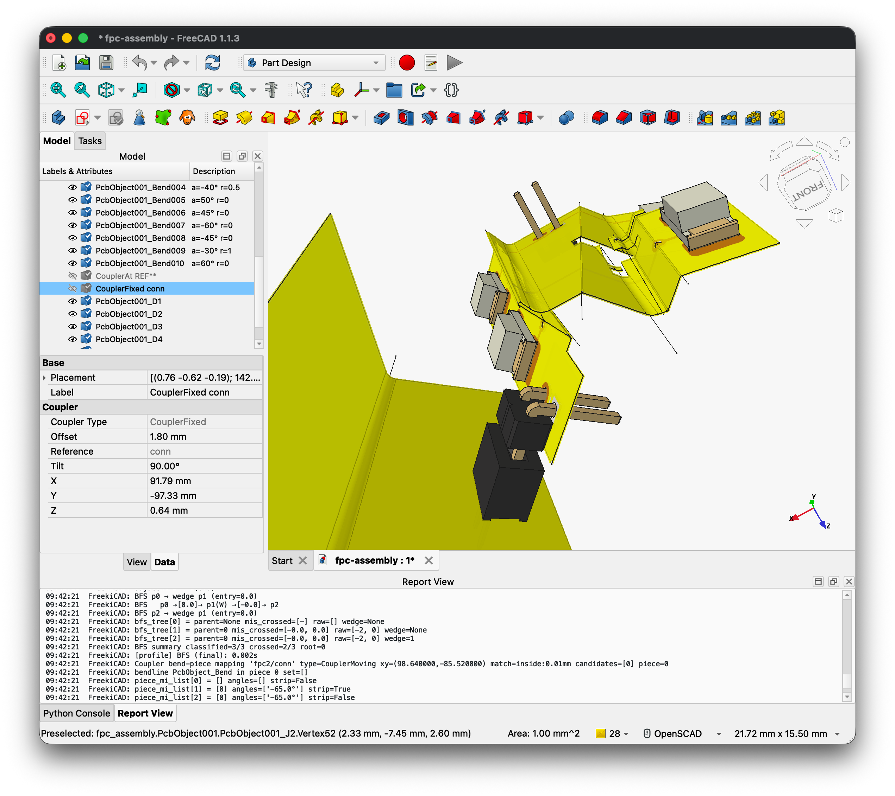

# Kikakuka Library
The KiCad library is stored under [`kicad-addon/library`](kicad-addon/library). Add [`kicad-addon/library/footprints/Kikakuka.pretty`](kicad-addon/library/footprints/Kikakuka.pretty) to KiCad's footprint library table (for example, as `Kikakuka`). Its [`Kikakuka.3dshapes`](kicad-addon/library/3dmodels/Kikakuka.3dshapes) directory contains the unit-cube placeholder and optional coupler helper models.

* [`Variable`](kicad-addon/library/footprints/Kikakuka.pretty/Variable.kicad_mod) displays its `Value` on the board. In the Kikakuka Fabrication Planner, use build-variant fields such as `Value#Flag` or `Value#Option=Choice` to show a value selected by the active build flags or options.
* [`StringTemplate`](kicad-addon/library/footprints/Kikakuka.pretty/StringTemplate.kicad_mod) formats its `Value` during Kikakuka Fabrication Planner export. Braced placeholders are replaced with matching footprint properties or build options after build-variant fields have been applied.
* [`CouplerFixed`](kicad-addon/library/footprints/Kikakuka.pretty/CouplerFixed.kicad_mod) and [`CouplerMoving`](kicad-addon/library/footprints/Kikakuka.pretty/CouplerMoving.kicad_mod) define matching planes for [coupler-based PCB alignment](#coupler-based-pcb-alignment). Give a pair the same reference and use their `Z`, `Offset`, and `Tilt` properties as needed.
* [`CouplerAt`](kicad-addon/library/footprints/Kikakuka.pretty/CouplerAt.kicad_mod) aligns its PCB to absolute FreeCAD world `TargetX`, `TargetY`, and `TargetZ` coordinates, all defaulting to zero. Place it on B.Cu for the usual behavior, where the PCB bottom surface is positioned at `TargetZ`; use F.Cu only to reference the top surface.

For coupler length properties (`Z`, `Offset`, `TargetX`, `TargetY`, and `TargetZ`), unitless values are millimetres; supported suffixes are `mm`, `in`, `mil`, and `um`/`µm`. `Tilt` is in degrees and may optionally use `deg` or `°`.

All three coupler footprints use the `Unspecified` type, placing their helper models under **Virtual Models** in KiCad's 3D Viewer.

The separate Kikakuka Tools IPC plugin provides **Coupler 3D Viewer** and **Hide Couplers** actions. Coupler 3D Viewer applies each coupler's `Z`, `Tilt`, and `Offset` to its helper model and opens KiCad's 3D Viewer; Hide Couplers marks these models hidden without removing them and also opens the Viewer. **Populate Placeholder 3D Models** likewise opens the Viewer after populating models. To omit couplers from STEP export, enable **Ignore 'Unspecified' components**.

The graphics-free [`Footprint`](resources/kikakuka-internal.pretty/Footprint.kicad_mod) placeholder used for BOM/CPL conversion is an internal application resource and is intentionally not included in the public footprint addon.

# Run from source (Linux/macOS)
Make sure your python can import `pcbnew`
```
> python3 -c "import pcbnew; print(pcbnew._pcbnew)"
<module '_pcbnew' from '/usr/lib/python3/dist-packages/_pcbnew.so'>
```
On macOS, I have to use the python interpreter bundled with KiCAD
```
PYTHON=/Applications/KiCad/KiCad.app/Contents/Frameworks/Python.framework/Versions/Current/bin/python3
```

On Linux, you should be able to just use the your default python3
```
PYTHON=python3
```

Create a virtual environment and install dependencies
```
${PYTHON} -m venv --system-site-packages env
./env/bin/pip3 install -r requirements.txt
```

Update submodule
```
git submodule update --init --recursive
```

Run
```
./env/bin/python3 kikakuka.py
```


# Run from source (Windows)
On Windows the Python interpreter is at `C:\Program Files\KiCad\10.0\bin\python.exe`.
But however in my Windows environment venv is not working properly, here is how I run it with everything installed in the KiCad's environment.
``` powershell
# Powershell
# Initialize bundled submodules after cloning
git submodule update --init --recursive

&"C:\Program Files\KiCad\10.0\bin\python.exe" -m pip install -r requirements.txt
&"C:\Program Files\KiCad\10.0\bin\python.exe" kikakuka.py
```

# CLI Usage
```
# Just open it
./env/bin/python3 kikakuka.py

# Start with PCB files
./env/bin/python3 kikakuka.py a.kicad_pcb b.kicad_pcb...

# Load file (.kkkk, .kkkk_fab, or legacy .kikit_pnl)
./env/bin/python3 kikakuka.py a.kkkk_fab

# Headless export for panelization or build variants
./env/bin/python3 kikakuka.py a.kkkk_fab out.kicad_pcb

# Differ
./env/bin/python3 kikakuka.py --differ a.kicad_sch b.kicad_sch

# Gerber to KiCAD Conversion
./env/bin/python3 kikakuka.py gerber.gbr out.kicad_pcb
./env/bin/python3 kikakuka.py gerber_folder out.kicad_pcb # BOM/CPL will be detected if they are in the folder
./env/bin/python3 kikakuka.py gerber.zip out.kicad_pcb
./env/bin/python3 kikakuka.py gerber.zip out.kicad_pcb bom_or_cpl_1.csv bom_or_cpl_2.csv # BOM/CPL files are determined by filename regardless of argument order
```

# Reverse-Engineering Notes for KiCAD Gerber
* Convert Gerber to .kicad_pcb with BOM/CPL using `Kikakuka`
* Footprint names are also exported, so `Tools -> Update Footprints from Library` can bring back the footprint if the name matches
* Lock the footprint, clean up with quick selection and deletion, unlock the footprint (you will need to set the `Selection Filter`)
