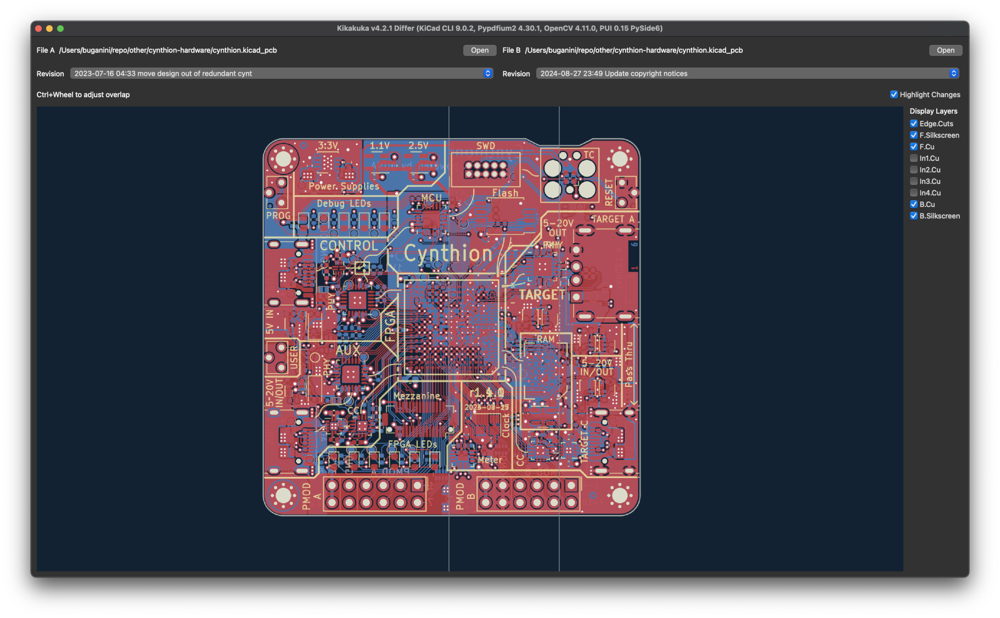
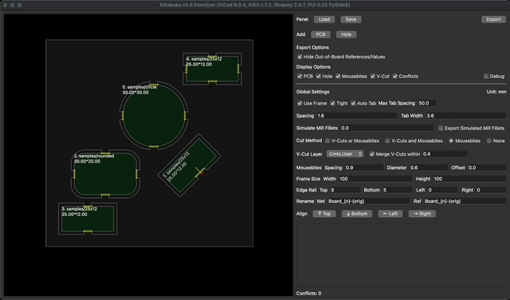

# KiCad Workspace Manager &  Panelizer & Differ


Kikakuka (企画課, きかくか, Planning Section) (formerly Kikit-UI) is mainly built on top of [KiKit](https://github.com/yaqwsx/KiKit), [Shapely](https://github.com/shapely/shapely), [OpenCV](https://github.com/opencv/opencv-python), [pypdfium2](https://github.com/pypdfium2-team/pypdfium2) and [PUI](https://github.com/buganini/PUI).

# Features
* Workspace Manager
    * Easily navigate between projects
        * Automatically open multiple KiCad instances on macOS
    * Recall windows of previously opened files (macOS and Windows only)
* Differ
    * Highlight changed areas
    * [Schematic diff viewer](#schematics-differ)
    * [PCB diff viewer](#pcb-differ)
    * Git support
* Panelizer
    * Build Variants (in the Panelizer)
        * Can be used for single PCB with frameless setting
        * Each PCB can have its own flag settings
    * Interactive arrangement with real-time preview
    * Freeform placement not limited to M×N grid configurations
    * Support for multiple different PCBs in a single panel
    * [Automatic](#auto-tab) or [manual](#manual-tab) tab creation
    * Automatic V-cut/mousebites selection
    * Enable [hole](#substrate-hole) creation in panel substrate for extruded parts
    * No coding skills required

# Workspace Manager
The `.kkkk` file saves workspace information in JSON format.


# Differ
## Schematics Differ


## PCB Differ

* A diff sample of [cynthion-hardware](https://github.com/greatscottgadgets/cynthion-hardware)

# Build Variants
Set `BUILDEXPR` in footprints' properties. This can be done quickly with `Symbol Fields Table` using the current sheet only scope. Remember to sync them to PCB afterward.
## BUILDEXPR
A boolean expression with operators:
* `~` Not
* `&` And
* `|` Or

e.g. `(A | ~B) & C`


## Per-PCB flags settings


## Footprints with the BUILDEXPR evaluated as false will be marked as DNP


# Panelizer
The `.kikit_pnl` file saves panelization settings in JSON format, with PCB paths stored relative to the file's location.

## Global Alignment


## Per-PCB Alignment


## Substrate Hole


## Tight Frame + Auto Tab + V-Cuts *or* Mousebites

### Output

### 3D Output


## Tight Frame + Auto Tab + V-Cuts *and* Mousebites


## Loose Frame + Auto Tab + Mousebites

### 3D Output


## Auto Tab
Tab position candidates are determined by the PCB edge and max_tab_spacing, prioritized by divided edge length (smaller first), and skipped if there is a nearby candidate (distance < max_tab_spacing/3) with higher priority.

In the image below with debug mode on, small red dots are tab position candidates, larger red circles are selected candidates, and the two rectangles represent the two half-bridge tabs.


## Manual Tab
Auto tab is off for PCB with manual tabs.
Drag inside the PCB for moving selected tab, drag outside the PCB for changing the direction for the selected tab.


# Run from source (Linux/macOS)
Make sure your python can import `pcbnew`
```
> python3 -c "import pcbnew; print(pcbnew._pcbnew)"
<module '_pcbnew' from '/usr/lib/python3/dist-packages/_pcbnew.so'>
```
On macOS, I have to use the python interpreter bundled with KiCAD
```
PYTHON=/Applications/KiCad/KiCad.app/Contents/Frameworks/Python.framework/Versions/Current/bin/python3
```

On Linux, you should be able to just use the your default python3
```
PYTHON=python3
```

Create a virtual environment and install dependencies
```
${PYTHON} -m venv --system-site-packages env
./env/bin/pip3 install -r requirements.txt
```

Run
```
./env/bin/python3 kikakuka.py
```

# Run from source (Windows)
On Windows the Python interpreter is at `C:\Program Files\KiCad\9.0\bin\python.exe`.
But however in my Windows environment venv is not working properly, here is how I run it with everything installed in the KiCad's environment.
```
"C:\Program Files\KiCad\9.0\bin\python.exe" -m pip install -r requirements.txt
"C:\Program Files\KiCad\9.0\bin\python.exe" kikakuka.py
```

# CLI Usage
```
# Just open it
./env/bin/python3 kikakuka.py

# Start with PCB files
./env/bin/python3 kikakuka.py a.kicad_pcb b.kicad_pcb...

# Load file (.kkkk or .kikit_pnl)
./env/bin/python3 kikakuka.py a.kikit_pnl

# Headless export
./env/bin/python3 kikakuka.py a.kikit_pnl out.kicad_pcb

# Differ
./env/bin/python3 kikakuka.py --differ a.kicad_sch b.kicad_sch
```

# Contributors
* @buganini
* @dartrax
