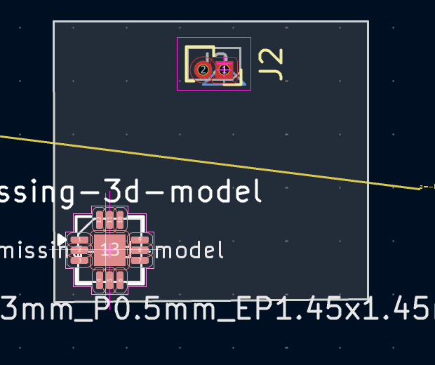
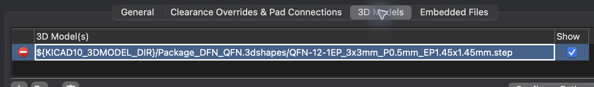
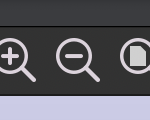
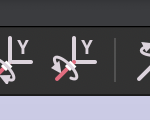

# Populate Scaled Placeholder 3D Models Pilot Run

Scenario:
[`../scenarios/kicad-plugin-Populate-scaled-placeholder-3D-models.md`](../scenarios/kicad-plugin-Populate-scaled-placeholder-3D-models.md)

## Environment

- Application: KiCad PCB Editor and 3D Viewer
- Board: `samples/fpc2.kicad_pcb`
- Target footprint reference: `missing-3d-model`
- PCB Editor window title: `fpc2 — PCB Editor`
- 3D Viewer window title: `3D Viewer`

## Window Layout

After opening the board, run **View > Zoom to Objects** in the PCB Editor
before opening the 3D Viewer or arranging windows. This keeps the target
footprint in a reproducible screen position for the final recording.

Bring the PCB Editor to the foreground before setting its frame. Place it over
the left four-fifths of the screen, place the 3D Viewer over the right third,
and make both windows fill the available work-area height without covering the
macOS menu bar or Dock. Then raise the 3D Viewer. The windows overlap
intentionally.

Maximize the window being inspected while locating controls and capturing
references. Restore the overlapping layout before the final recording.

## Footprint Selection

Use **Edit > Find** only during the pilot run to locate `missing-3d-model`.
Record the target footprint's visible pattern and click location in the pilot
notes, then use direct pointer clicks during the final recording. Do not use
Find while recording.

The target footprint is the QFN footprint labeled `missing-3d-model`, below
the yellow ratsnest line. Use the `missing-3d-model` reference text and the
large center pad labelled `13` as the visual anchors. During recording, click
on the magenta footprint outline instead of the pads, then use a pointer-visible
route to open **Footprint Properties**. The outline is a safer click target
because the pads and text are less likely to intercept selection.



The footprint contains pads at its center, so unrestricted pointer actions can
open an item-disambiguation menu. Before recording, disable **All items** in
the Selection Filter and enable only **Footprints**. Then select the footprint
by clicking its outline and use the context menu or another visible pointer
operation to open **Footprint Properties**.

In the formal full-height layout after **Zoom to Objects**, the verified click
target is the left magenta outline of the QFN footprint, around screen point
`{153, 815}` on the current macOS display.

## Footprint Properties

The first tab is named **General**. Its plus button below the Fields table adds
a custom property as a new `FieldN` row; edit that row's Name and Value cells.

The **3D Models** tab shows the unresolved model with a red minus icon. This is
the state used for the `Invalid 3D model` caption. During recording, switch to
this tab with the pointer and hold this view long enough for the invalid model
path to be readable.



## Toolbar Controls

Leave the pointer over an unfamiliar toolbar icon until its tooltip appears
before relying on its position.

### Populate Placeholder 3D Models

Use the Kikakuka action with the cube overlay.


### Zoom Out

Use the magnifying-glass button containing a minus sign. It is between Zoom In
and Zoom to Fit.



### Rotate Y CCW

Use the right-hand button in the adjacent pair labelled `Y`. The left-hand
button rotates clockwise.



## Recording Notes

- Start from `killall pcbnew`, not from a normal quit, so no previous PCB Editor
  or 3D Viewer window can affect the recording. Run this from `[Sub shell]`.
- Run `git checkout -- samples/fpc2.kicad_pcb` from `[Sub shell]`. Do not run
  Git checkout from a background automation shell that may be sandboxed away
  from `.git/index.lock`. If that error appears, rerun the Git command from
  `[Sub shell]` instead of reconstructing the file manually.
- Use Terminal.app only for the FFmpeg recording command. Other CLI commands in
  this scenario should run from `[Sub shell]`, not through AppleScript or GUI
  terminal automation.
- Use Codex's background shell only for passive inspection, not for commands
  that require Git metadata writes, screen recording permission, or GUI event
  injection.
- When preparing the sample board, remove `SizeX`, `SizeY`, and `SizeZ` as
  whole four-line KiCad property blocks only. Do not use a greedy expression
  that can consume the following pad definitions; verify the setup by checking
  that the board still contains the expected QFN pads.
- If the board does not open as expected, validate
  `samples/fpc2.kicad_pcb` before trying another launch path. A good prepared
  file has one `missing-3d-model` reference, no `SizeX`, `SizeY`, or `SizeZ`
  properties, and 17 pads. KiCad CLI should also be able to read it.
- On macOS, the GUI automation tool must have Accessibility permission if it
  drives pointer and keyboard events during recording.
- Activate the project `env`, then open the board directly with `python3
  python3 -m kikakuka --open samples/fpc2.kicad_pcb` rather than through the PCB
  Editor's Open dialog or a guessed `open` / app-bundle invocation.
- Open the 3D Viewer with **View > 3D Viewer**.
- Configure the Selection Filter during Setup, outside the recorded Script.
- The plugin action brings the 3D Viewer forward after populating the model.
- Cancel any property edits made while rehearsing the workflow.

## Capture Device Check

Run the AVFoundation device check from the actual Terminal.app session used for
recording after granting Screen & System Audio Recording permission and
relaunching Terminal.app:

```sh
ffmpeg -f avfoundation -list_devices true -i ""
```

Use the video device named `Capture screen 0` with no audio input, for example
`-i "2:none"` if the device list reports `Capture screen 0` as index `2`.

The Codex background shell cannot see the AVFoundation capture devices in this
environment, so do not use its device-list result to choose the recording
index.
